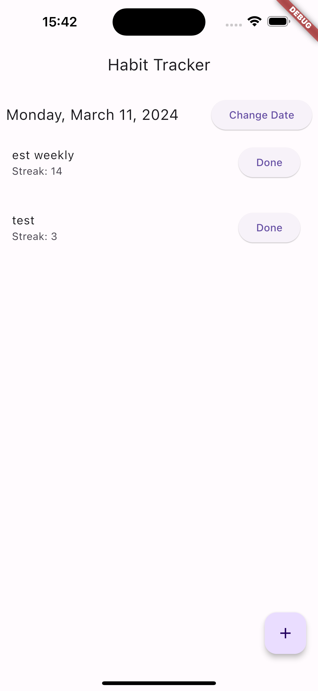
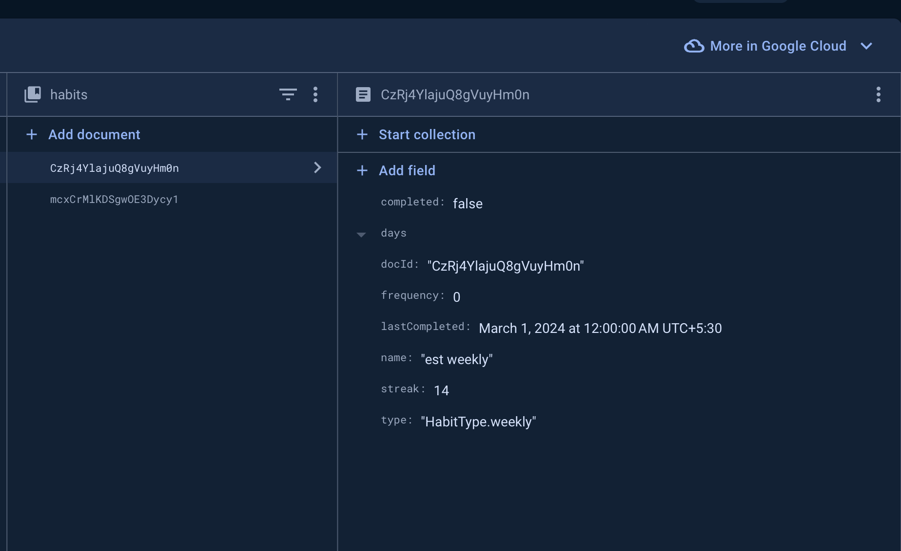

# Habit Tracking App

## Overview

The Habit Tracking App is a Flutter application that allows users to track their daily and weekly habits, calculate streaks, and stay motivated to achieve their goals.

## Features

- **Daily and Weekly Tracking**: Users can track habits either daily or weekly.
- **Streak Calculation**: Streaks are calculated based on consecutive days of habit completion or meeting weekly goals.
- **Error Handling**: Users are alerted when trying to add a habit without entering a name.

## Getting Started

To run this app locally, follow these steps:

1. Clone the repository:

   ```bash
   git clone https://github.com/Abhishek01039/habit-demo.git
   ```

2. Navigate to the project directory:

   ```bash
   cd habit-tracking-app
   ```

3. Install dependencies:

   ```bash
   flutter pub get
   ```

4. Run the app:

   ```bash
   flutter run
   ```

## Running tests

### To run tests for this app, use the following command:

```bash
flutter test
```

## Executable App

The executable app can be found in the [APK](apk/app-release.apk)

## Documentation

For detailed documentation on the app's features and implementation, see the [Documentation](docs/documentation.md) file.

## HomeScreen Example



## Database Schema for Habit Collection



## License

This project is licensed under the MIT License - see the LICENSE file for details.
